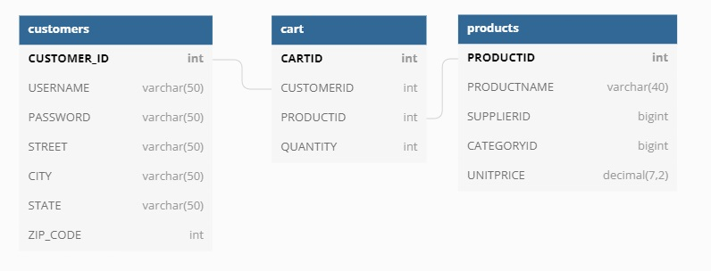
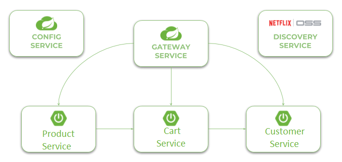

# Microservices with Spring Cloud

## Initial Configuration

### Database Configuration
- Create a new Schema with the following tables:
#### Products
```shell
CREATE TABLE `products` (
  `PRODUCTID` int NOT NULL AUTO_INCREMENT,
  `PRODUCTNAME` varchar(40) NOT NULL,
  `SUPPLIERID` bigint DEFAULT NULL,
  `CATEGORYID` bigint DEFAULT NULL,
  `UNITPRICE` decimal(7,2) DEFAULT NULL,
  PRIMARY KEY (`PRODUCTID`)
);
```
#### Cart
```shell
CREATE TABLE `cart` (
  `CARTID` int NOT NULL AUTO_INCREMENT,
  `CUSTOMERID` int DEFAULT NULL,
  `PRODUCTID` int DEFAULT NULL,
  `QUANTITY` int DEFAULT NULL,
  PRIMARY KEY (`CARTID`),
  KEY `CUSTOMER_ID_idx` (`CUSTOMERID`),
  KEY `PRODUCT_ID_idx` (`PRODUCTID`),
  CONSTRAINT `CUSTOMER_ID` FOREIGN KEY (`CUSTOMERID`) REFERENCES `customers` (`CUSTOMER_ID`),
  CONSTRAINT `PRODUCT_ID` FOREIGN KEY (`PRODUCTID`) REFERENCES `products` (`PRODUCTID`)
);
```
#### Customer
```shell
CREATE TABLE `customers` (
  `CUSTOMER_ID` int NOT NULL AUTO_INCREMENT,
  `USERNAME` varchar(50) NOT NULL,
  `PASSWORD` varchar(50) NOT NULL,
  `STREET` varchar(50) NOT NULL,
  `CITY` varchar(50) NOT NULL,
  `STATE` varchar(50) NOT NULL,
  `ZIP_CODE` int NOT NULL,
  PRIMARY KEY (`CUSTOMER_ID`)
);
```

### Reconfigure application.yml files
- For **product-service**, **cart-service**, and **customer-service**, rename the included **template.yml**
file to **application.yml**
- In the **application.yml** file, update the following: 
  * DATABASE-PORT - The port location of your local database instance
  * SCHEMA-NAME - The name of the Database Schema that contains your tables
  * USERNAME - the username used to log into your MySQL workbench
  * PASSWORD - the password used to log into your MySQL workbench

### Execution Steps:
1. Start Config Service
2. Start Discovery Service
3. Start Gateway Service
4. Start Product Service
5. Start Cart Service
6. Start Customer Service

## Documentation
### API Endpoints - SwaggerUI
```shell
https://localhost:8060/swagger-ui.html
```


### MySQL Database


<!--  -->
### Microservice Architecture


<!--  -->
